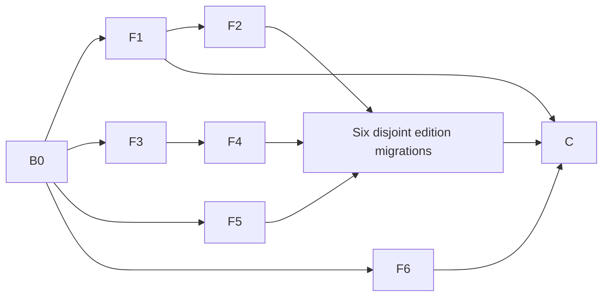

# Edition sharing plan

> **Archived 2026-09-27.** Kept for history; paths and state below may be out of date. Superseded by `docs/archive/reviews/redundancy-audit-2026-09-27.md`; the plan landed on `portfolio-3d` as `2a5f42a..b71fb63`. See `docs/archive/README.md`.

Status: **Migration packages integrated on `fm/portfolio-edition-refactor` (F1-F6, route loaders, command-menu hook, Radix declaration removal, Timetable ask OG dedupe).** Inventory and audit docs refreshed on `fm/portfolio-refactor-inventory` (`bun scripts/redundancy-inventory.ts`, 1,051 rows; 15 intentional exact-byte groups, zero unintentional). Final visual, build, and e2e gates remain. This plan uses the [audit](../reviews/redundancy-audit-2026-09-27.md) and its complete inventory (not retained in repository). It is intentionally narrower than “make all files look different”: identical CSS, JSX, copy or thin Next route shells may be correct. Success means there is one implementation of each shared behavior, and all six editions still look and act the same.

## Target tree and module interfaces

```text
app/f/<edition>/**                  required Next route files; edition composition and metadata copy only
components/semantic/ask/**         existing composer, owner, pending, moderation hooks
components/semantic/command/**     existing search state and shortcuts; no edition detection
components/semantic/{lab,scene,interaction,prefs,link-preview,visitor-count}/**
lib/env.ts                          T3Env client-safe public values
lib/env.server.ts                   T3Env server values, server-only
lib/flavor-routing.ts               pure routing with caller-supplied live-ID predicate
lib/ask/pages/**                    data loading, params and canonical metadata
lib/command/**                      index, matching and pure href mapper input
lib/data/project-page.ts            project lookup/static params/metadata
lib/data/continuity-lanes.ts        timeline lane algorithm
lib/prefs/**, lib/lab/**, lib/scene/**, lib/resume/**
flavors/registry.ts                 one registry: IDs/status plus picker names, taglines and swatches
flavors/<edition>/content.ts        edition navigation, labels and copy
flavors/<edition>/lib/**            preference schema, local scene models, design transforms
flavors/<edition>/components/**     markup, CSS, motion and thin headless-hook adapters
```

The useful seams are already mostly present. Keep these interfaces stable: `createPrefsStore<P>({ key, defaults, migrate })`, `loadResumeData(): Promise<ResumeData>`, `useAskComposer(options)`, `useCommandShortcuts(options)`, `useSceneMount(options)`, `useVisitorCount()`, and `SignatureFieldScene({ colors, fontClass, onReady })`. Do not add one universal page component or a shared file that renders edition classes. A required Next `page.tsx` that imports an edition renderer is acceptable glue; the load/validation/metadata algorithm belongs in `lib`.

The new interfaces proposed for this migration are:

```ts
// lib/flavor-routing.ts
export function routeFlavor<F extends string>(
  request: {
    pathname: string;
    searchParams: URLSearchParams;
    cookie: string | undefined;
  },
  options: { defaultFlavor: F; isLiveFlavor: (value: unknown) => value is F }
): FlavorRoute<F>;

// lib/command/localize-index.ts, no edition import or switch
export function localizeSearchIndex(
  index: SearchIndex,
  hrefForUpdate: (year: string) => string
): SearchIndex;

// lib/ask/pages/load.ts
export async function loadAskList(page: number): Promise<{
  items: Question[];
  total: number;
  pageCount: number;
}>;

// lib/data/project-page.ts
export async function projectStaticParams(): Promise<{ slug: string }[]>;
export async function projectMetadata(slug: string): Promise<Metadata>;
export async function loadProjectPage(
  slug: string,
  order?: (projects: Project[]) => Project[]
): Promise<{
  project: Project;
  projects: Project[];
  index: number;
  previous: Project | undefined;
  next: Project | undefined;
} | null>;

// lib/data/continuity-lanes.ts, moved without behavior edits
export function computeContinuityLanes(
  roles: readonly Experience[]
): ContinuityLanes;
```

`lib/env.ts` retains the public `env.siteUrl` and `env.sanity.{projectId,dataset,apiVersion}` shape for callers. `lib/env.server.ts` exposes typed optional server variables with the same empty/default semantics as today. `process.env` may appear only inside the T3Env initialization boundary because that package needs runtime input. All other access goes through typed exports. This preserves buildability with an empty `.env.local`.

## Packages

Each package is one sub-agent branch and one commit, based on `portfolio-3d` through the integration branch at its dependency point. “Edit” and “delete” lists are exhaustive for source files; tests named below may be added. An agent must stop on a behavior difference that contradicts its interface. Independent work runs in separate Git worktrees so branch switching cannot disturb another agent. The coordinator integrates reviewed commits in dependency order. All checks, builds and browsers run one at a time across worktrees; test invocations use `--maxWorkers=2`.

| ID                             | Goal and files                                                                                                                                                                                                                                                                                                                                                                                                                                                                                                                                      | Exact interface / preservation check                                                                                                                                                                                                                                                                                                                                                                      | Depends on             |
| ------------------------------ | --------------------------------------------------------------------------------------------------------------------------------------------------------------------------------------------------------------------------------------------------------------------------------------------------------------------------------------------------------------------------------------------------------------------------------------------------------------------------------------------------------------------------------------------------- | --------------------------------------------------------------------------------------------------------------------------------------------------------------------------------------------------------------------------------------------------------------------------------------------------------------------------------------------------------------------------------------------------------- | ---------------------- |
| **B0 Baseline**                | Read only: capture 390/1440 light/dark/reduced-motion screenshots and interaction traces for six editions, plus current lint/type/unit/build/e2e results. Write findings in `docs/archive/reviews/redundancy-audit-2026-09-27.md` only.                                                                                                                                                                                                                                                                                                                                        | Verify ask paging, command shortcuts, preferences, scene T0/no-WebGL, scroll and print before migration.                                                                                                                                                                                                                                                                                                  | None                   |
| **F1 Env**                     | Create `lib/env.server.ts`; edit `lib/env.ts`, `lib/ask/{config,http,owner-session,submission-route}.ts`, `lib/visits/store.ts`, `app/api/{revalidate,visits}/route.ts`, `sanity.config.ts`, `sanity/lib/token.ts`, `scripts/{seed,find-duplicates}.ts`, `next.config.ts`, `playwright.config.ts`, `package.json`, `bun.lock`.                                                                                                                                                                                                                      | `env` public shape stays; `serverEnv` has `SANITY_API_READ_TOKEN`, `SANITY_API_WRITE_TOKEN`, `SANITY_REVALIDATE_SECRET`, `ASK_COOKIE_SECRET`, `ASK_OWNER_PASSPHRASE`, `ASK_PENDING_CAP`, `ASK_TRUST_PROXY` as typed optional values. Also type `NODE_ENV`, `CI`, `PLAYWRIGHT_CHROMIUM_PATH` at the boundary used by config/scripts. Preserve all empty defaults. Add a no-env and malformed-number check. | B0                     |
| **F2 Base UI**                 | Edit `flavors/minimal/components/command/command-dialog.tsx` and `e2e/command-menu.spec.ts`; delete no local markup file.                                                                                                                                                                                                                                                                                                                                                                                                                           | Replace direct Radix dialog with `@base-ui/react` Dialog, preserve cmdk search and focus restoration. Keep `cmdk` and its transitive Radix dependencies, as the owner clarified. Remove the direct `@radix-ui/react-dialog` declaration in package D below.                                                                                                                                               | B0                     |
| **F3 Routing IDs**             | Edit `lib/flavor-routing.ts`, `proxy.ts`, and `lib/__tests__/flavor-routing.test.ts`. Keep `flavors/registry.ts` as the single source of IDs/status and picker copy.                                                                                                                                                                                                                                                                                                                                                                                | `routeFlavor(request, { defaultFlavor, isLiveFlavor }): FlavorRoute<F>` as above. `proxy.ts` passes the existing registry predicate/default; the routing module imports no flavor file. Picker names/swatches remain in `flavors/registry.ts`. Verify first-visit `/`, deep links, bad cookie, `?flavor=` and future IDs.                                                                                 | B0                     |
| **F4 Command localization**    | Edit `lib/command/{localize-index,build-index}.ts`, `components/semantic/command/{use-command-data,use-command-dialog}.ts`, all six `flavors/E/components/command/command-dialog.tsx`, and existing `lib/command/__tests__/localize-index.test.ts` plus `components/semantic/command/__tests__/use-command-data.test.tsx`; delete `lib/command/{read-flavor,changelog-href}.ts` and `lib/command/__tests__/changelog-href.test.ts` after callers move. No `command-menu.tsx` edits.                                                                 | `localizeSearchIndex(index, hrefForUpdate)` above. `useCommandData` receives the mapper as an option, rather than reading `<html data-flavor>`. Minimal supplies `/changelog#${year}`; other editions supply `/now#log-${year}`. `buildSearchIndex()` emits the same default public hrefs without importing the registry. Preserve search ordering, recents and retry.                                    | F3                     |
| **F5 Ask and project loaders** | Create `lib/data/project-page.ts`; edit `lib/ask/pages/load.ts`; add `lib/data/__tests__/project-page.test.ts` and edit existing `lib/ask/pages/__tests__/load.test.ts`. Do not edit route JSX.                                                                                                                                                                                                                                                                                                                                                     | Use interfaces above. Preserve `dynamicParams`, invalid slug/page 404 and canonical metadata. The project order function is an optional input because editions choose ordering. The ask loader uses `ASK_PAGE_SIZE` and `getQuestions` once for its requested page.                                                                                                                                       | B0                     |
| **F6 Continuity and cycle**    | Create `lib/data/continuity-lanes.ts`; edit imports in `flavors/minimal/components/experience/{experience-timeline,timeline-rail}.tsx`, `flavors/drawing-set/components/work/{experience-timeline,timeline-rail}.tsx`, `flavors/drawing-set/components/site/scene-posters.tsx`; delete `flavors/minimal/components/experience/continuity-lanes.ts` and `flavors/drawing-set/components/work/continuity-lanes.ts`; move `flavors/minimal/components/experience/__tests__/continuity-lanes.test.ts` to `lib/data/__tests__/continuity-lanes.test.ts`. | Preserve `computeContinuityLanes(roles)` and `ContinuityLanes`; make the poster's `SceneRoute` type import come from `flavors/drawing-set/lib/scene/poses.ts`. No runtime graph or SVG changes.                                                                                                                                                                                                           | B0                     |
| **M-minimal**                  | Edit `app/f/minimal/ask/{page.tsx,page/[page]/page.tsx,[slug]/page.tsx}` only; its project-detail redirect stays untouched.                                                                                                                                                                                                                                                                                                                                                                                                                         | Use shared ask/project loaders; keep Minimal's project-detail redirect, `/about` redirect, `/changelog` page, all JSX/copy. Before: route calls `getQuestions({ page, pageSize: ASK_PAGE_SIZE })`; after: route calls `loadAskList(page)` and renders the same `ChatFeed` props.                                                                                                                          | F4, F5, F2             |
| **M-drawing-set**              | Edit `app/f/drawing-set/ask/{page.tsx,page/[page]/page.tsx,[slug]/page.tsx}` and `app/f/drawing-set/projects/[slug]/page.tsx`.                                                                                                                                                                                                                                                                                                                                                                                                                      | Same loader call; keep Drawing Set title blocks, scene slot, project order and copy. Preserve `rfi:sent` scene event.                                                                                                                                                                                                                                                                                     | F4, F5                 |
| **M-surface**                  | Edit `app/f/surface/ask/{page.tsx,page/[page]/page.tsx,[slug]/page.tsx}` and `app/f/surface/projects/[slug]/page.tsx`.                                                                                                                                                                                                                                                                                                                                                                                                                              | Same loader call; keep Control Surface panel/knob, keys and motion.                                                                                                                                                                                                                                                                                                                                       | F4, F5                 |
| **M-survey**                   | Edit `app/f/survey/ask/{page.tsx,page/[page]/page.tsx,[slug]/page.tsx}` and `app/f/survey/projects/[slug]/page.tsx`.                                                                                                                                                                                                                                                                                                                                                                                                                                | Use shared ask loading and project static params/metadata. Keep Survey project body loading with `Promise.all([getProjects(), getRelief()])` and `surveyNeighbourOrder`, since relief-backed `SurveyNeighbour` entries carry edition-specific refs and are not `Project[]`. Keep notebook copy, relief scene and sequence map.                                                                            | F4, F5                 |
| **M-timetable**                | Edit `app/f/timetable/ask/{page.tsx,page/[page]/page.tsx,[slug]/page.tsx}` and `app/f/timetable/projects/[slug]/page.tsx`.                                                                                                                                                                                                                                                                                                                                                                                                                          | Same loader call; keep Timetable notice numbering, network and platform scene.                                                                                                                                                                                                                                                                                                                            | F4, F5                 |
| **M-press**                    | Edit `app/f/press/ask/{page.tsx,page/[page]/page.tsx,[slug]/page.tsx}` and `app/f/press/projects/[slug]/page.tsx`.                                                                                                                                                                                                                                                                                                                                                                                                                                  | Same loader call; keep Press Proof query numbering, plate order and print styling.                                                                                                                                                                                                                                                                                                                        | F4, F5                 |
| **C Cleanup/docs**             | Edit `docs/{redundancy-audit,redundancy-plan,flavors}.md`; remove only verified unused exact-copy barrels/tests and unused direct dependencies from `package.json`/`bun.lock`. No edition CSS/poster deletion based only on bytes.                                                                                                                                                                                                                                                                                                                  | Add a short “How to add a new edition” section showing ID/registry, route shells, local presentation, standard shared hooks and required tests. Re-run the inventory scan and record remaining intentional design copies.                                                                                                                                                                                 | All migration packages |

The six `M-*` packages have disjoint edition files and can run in parallel in separate worktrees. F1 and F2 both edit the lockfile and therefore integrate serially. F3 and F5 and F6 have disjoint files. F4 owns all six local `command-dialog.tsx` files. The `M-*` packages own route files only and therefore remain disjoint.



## Current handoff and remaining packages

F1 through F6, F4 (including Minimal `hrefForUpdate`), direct Radix removal, all six edition route loader integrations, shared `useCommandMenu`, and Timetable ask OG dedupe are committed on `fm/portfolio-edition-refactor` (`4cc0ce3`). Docs branch `fm/portfolio-refactor-inventory` regenerates inventory (not retained in repository) and updates [redundancy-audit.md](../reviews/redundancy-audit-2026-09-27.md) / this plan. Lint and 837 unit tests (`--maxWorkers=2`) pass on the integration tip. Remaining: optional C-package barrel cleanup, `web-vitals` direct dependency decision, drawing-set scene cycle type import, then production build, Playwright e2e, and six-edition visual comparison against `348d13e`.

The owner's later clarification permits `cmdk` and its transitive Radix packages. Keep `cmdk` and its search/keyboard behavior. Direct Radix imports and the direct `@radix-ui/react-dialog` dependency must go. A custom command primitive or scorer is outside this plan.

| Package                              | Exact ownership and API                                                                                                                                                                                                                                                                                                                                    | Dependency                                                 | Acceptance                                                                                                         |
| ------------------------------------ | ---------------------------------------------------------------------------------------------------------------------------------------------------------------------------------------------------------------------------------------------------------------------------------------------------------------------------------------------------------- | ---------------------------------------------------------- | ------------------------------------------------------------------------------------------------------------------ |
| **M-route-bundle**                   | The three existing route files for each of Drawing Set, Press and Surface: `ask/page.tsx`, `ask/page/[page]/page.tsx`, `projects/[slug]/page.tsx`. Apply their completed isolated worktree diffs. `loadAskList(page)`, `projectStaticParams()`, `projectMetadata(slug)`, and `loadProjectPage(slug, orderProjectsForCatalog)` replace route-local loading. | F5                                                         | Same metadata, 404 timing, order, pagination, render props and JSX.                                                |
| **D Direct Radix dependency**        | `package.json`, `bun.lock` only. Remove direct `@radix-ui/react-dialog`; retain `cmdk` and its transitive dependencies.                                                                                                                                                                                                                                    | F1 lockfile, F2 source                                     | No direct Radix source import or dependency; command e2e still passes.                                             |
| **A Minimal and Timetable adapters** | `flavors/minimal/components/command/command-dialog.tsx` supplies stable `hrefForUpdate: (year: string) => string` with `/changelog#${year}`. Timetable's two `ask/*opengraph-image.tsx` wrappers delegate to `components/og/ask.tsx`, matching the other five editions.                                                                                    | F4 shared hook, existing OG helper                         | Minimal builds; OG alt, size, metadata, static params and fallback card stay equal.                                |
| **H Command-menu behavior**          | Create `components/semantic/command/use-command-menu.ts` with `useCommandMenu(keys: Readonly<Record<string, string>>): { open: boolean                                                                                                                                                                                                                     | null; setOpen: React.Dispatch<React.SetStateAction<boolean | null>> }`; update the six local `command-menu.tsx` files to call it. The local dynamic dialog import and JSX stay. | Existing `useCommandShortcuts` | Same lazy-load boundary, shortcut keys, router navigation and dialog toggle; focused hook test. |
| **M-remaining**                      | Minimal, Survey and Timetable ask list route files, plus Survey and Timetable project detail route files. Use F5 contracts. Keep Minimal project redirect. Survey uses shared static params and metadata but retains relief-backed body and `SurveyNeighbour[]` navigation locally.                                                                        | F5, A                                                      | Same route/render/scene behavior. One separate branch and reviewer per edition.                                    |
| **C Final cleanup/docs**             | `docs/archive/reviews/redundancy-audit-2026-09-27.md`, `docs/archive/plans/redundancy-plan-2026-09-27.md`, `docs/flavors/README.md`; only proven dead barrels, exports, tests or direct dependencies. Re-run the inventory and dependency scan.                                                                                                                                                                       | All source packages                                        | Remaining duplication is edition design or required Next route glue, documented with counts.                       |

`M-route-bundle`, D, A, H and the three M-remaining editions own disjoint source files, except A and D both base their Minimal dialog on F2 and F4. Timetable OG is reserved for A. D alone owns the lockfile. Checks, production builds, e2e and browser runs remain serial across worktrees. Each implementation agent works on its own branch, reports unexpected differences before changing scope, and commits only its package. The coordinator reviews the diffs and integrates in dependency order. The user performs the final review before any merge into `portfolio-3d`.

## Agent brief and integration gate

Before starting Phase 3, the coordinator gives each agent a self-contained brief with the exact versioned base commit, files to read first, files to edit/create/delete and files it must not touch, the interface above, and one before/after call-site example. The brief pastes the entire sharing rule and hard rules from the user's request, including no visual/behavior changes, Base UI only, T3Env only, no casts or `any`, typedRoutes off, branch and commit rules, protected `fm/portfolio-no-radix` and `THREE.Clock`, and machine-care limits. Each agent works on its own branch from the integration base in an isolated worktree, makes one small conventional lowercase commit with `--no-gpg-sign --no-verify`, and never pushes or merges.

An agent runs `bun run lint`, `bun run type-check`, and `bun run test -- --maxWorkers=2` plus focused tests before reporting. The coordinator schedules these checks serially across agents. The report includes commit SHA, changed files, checks and any unexpected edition difference; the agent stops instead of guessing. The coordinator checks every diff for sharing-rule violations, casts, lost edge cases and visual edits, integrates in graph order and reruns the full three checks after each integration. This is an integration quality gate; the user's final review remains separate.

After C: production build, Playwright e2e, then browser passes at 390 and 1440 pixels in light, dark and reduced motion for every edition. Compare with the original `portfolio-3d` checkout, including route HTML and OG output. Check browser and server consoles, keyboard/focus, custom scrollbars and smooth scroll, cursor/sound, scenes and T0/no-WebGL. Run heavy jobs one at a time. Re-run the same file and behavior audit, update the counts and inventory, and keep only intentional edition design duplication. The final branch remains unpushed and separate from `portfolio-3d` for the user's review.
